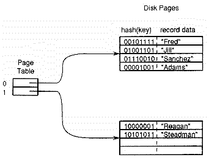
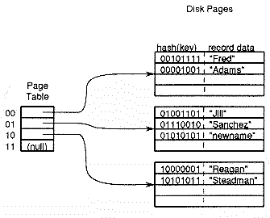

# Hashing: From Good To Perfect

**Ron Burk**

*Ron Burk has a B.S.E.E. from the University of Kansas and has been a programmer for the past 10 years. You may contact him at Burk Labs, P.O. Box 3082, Redmond, WA 98073-3082. CIS: 70302, 2566.*

---

Hashing is one of the most elegant responses in computer software to the limitations of computer hardware. You may not have seen hashing used anywhere but in limited database applications, but the basic algorithm has found wide use. This article covers some of the ways the hashing algorithm has been extended, and its application to a variety of problems. Some useful code fragments may aid your own implementation of hashing. First, however, let's review basic hashing.

## The Basics

Probably the most common use of hashing is to organize database files. Suppose you are writing software that runs cash machines for a bank with 50,000 customers. When a customer inserts their card into the cash machine, your software must quickly locate that customer's records (such as the account balance) using the 16-digit number on their card. In database terminology, the card number is the "key" to the customer database.

Clearly, a sequential search of 50,000 records will require too much disk I/O. An indexed file scheme (such as a B-Tree) could cut the search to just two or three disk reads, but even that may be prohibitive; you must provide fast responses to many customer requests on inexpensive hardware.

Hashing is a simple, efficient solution to this problem. First, create the card database as a file containing `2N` empty, fixed-length records, where `N` is the total number of records you expect to store. Second, store each customer entry at the record position obtained by feeding that customer's card number through a hashing function (a mathematical function that transforms the key to an integer value in the range `0` to `2N-1`). Here is an example of a simple hashing function that maps 16-digit card numbers into a record number between `0` and `99,999`:
```c
long hash(char *cardnum) {
   long h = 0;
   while (*cardnum)
      h = (h << 4) ^ *cardnum++;
   return h % 100000;
}
```

The hashing function uses the record key to calculate a location for the record, whereas an indexed scheme like a B-tree uses tables to store and retrieve the correct record position. The advantage of hashing is speed; there are some disadvantages, however.

The most obvious disadvantage of hashing is the problem of collisions. For example, the hashing function given above maps card number `1234567812345678` and card number `1202120038744598` to the same record position: `32808`. A simple solution to collisions is to store the record at the next empty position. In general, you must store the record key as part of the record to determine whether the hashing function has indexed the desired record or the subsequent positions must be searched due to a collision.

Another shortcoming of hashing is the requirement for fixed-size tables. While B-trees are designed to grow and shrink gracefully, adapting to record insertions and deletions, the basic hashing scheme requires an I/O-intensive reorganization to convert tables to larger or smaller sizes. Worse, extra space is usually allocated for hash tables to reduce the number of collisions. That is why the example used a hash table twice as large as the expected number of entries.

Still another problem with hashing is that the records are scattered arbitrarily in a disk file. Suppose you have a large database of customers in which the primary key is the customer name. If the file is organized as a B-tree, then producing a listing sorted by customer name requires relatively little disk I/O, since the records themselves are maintained sorted by key. If the same database is kept as a hashed file, then accessing the customers in sorted order may require as many disk reads as there are customer records.

Some interesting algorithms have evolved from the basic hashing algorithm; some attempt to address shortcomings, while others simply put various disadvantages to good use.

## Extendible Hashing

For some time, there was a dichotomy between hashed database organizations and indexed database organizations. You could get fast record access with a hashed file or the ability to grow and shrink gracefully with a B-tree, but you couldn't get both. In the past decade, however, several hashing techniques for expandable files have been devised.

Extendible hashing is an algorithm that provides the speed of a hashed file and the extensibility of a B-tree. Extendible hashing requires a hash function and a table of pointers to disk pages. A disk page is simply a fixed-size chunk of disk (say, 4K bytes long) which is the basic unit of disk I/O for the database. A particular page may contain many database records. In general, the cost of disk I/O is high enough that database design focuses on locating the correct page in as few disk reads as possible and ignores the cost of locating the correct record within that page.

Extendible hashing views the hashed key as an index into the table of page pointers. The size of the page table is required to be a power of two; only enough bits to address the full page table are used from the hashed key as an index.



The algorithm is easier to understand with an example. Figure 1 shows an extendible hash database which contains a few records. The page table has two entries and both point to empty database pages. To insert a record, hash the record key and use the most significant bit of the hash as an index into the page table. The result points to the page where the record should be inserted.



So far this is simple. All new records will be inserted into one of the two database pages, based on the first bit of the hashed record key. However, when one of the pages becomes too full to add another record, that page must split and things get interesting. Figure 2 shows what might happen to the database in Figure 1 after one more record insertion.

When a page in the database overflows, there are too many keys with identical values in their first `N` bits, where `2N` is the current page table size. To handle the overflow, you double the size of the page table and divide the records in the too-full page between that page and its new "buddy" page – the page whose index is the same except for the last bit. For example, the buddy of page `0110` is page `0111`.

The extendible hash table can shrink in an analogous way. When you delete a record from a disk page, if the number of the records on that page has fallen below some threshhold, then check the buddy page to see if it has room to hold the records from both pages. If two pages can be coalesced, then you may also be able to halve the size of the page table.

An objection to extendible hashing is the need for additional memory requirements to store the page table. For many applications, though, only a modest amount of memory is needed. For example, suppose you use this algorithm on a PC. By reserving 64K bytes (32K two-byte integers) for the page table and using a 4K disk page size, you can handle a database of up to 128M bytes (32K pages of 4K bytes each)!

I presented only the fundamentals of extendible hashing here; there are several published improvements and variations. There is also an alternative, called linear hashing, that requires no page table in memory, but is a bit slower than one disk read per record fetch. There is no room to discuss all these altenatives, but see the references listed at the end of this article for details.

## Collisions

Collisions are annoying for implementors of the hashing algorithm. Even though the odds of a collision may be small (as they will be if you have a good hashing function and fill only a small percentage of the hash table), you always have to check for collision.

One way to remove the annoyance without actually solving the problem is to find applications where collisions don't matter. There are quite a number of these applications and they have the following in common: they can live with answers that are right most of the time.

A good example of an application that can live with collisions is checksumming. When you send a packet of data across a noisy telephone line, you need to ensure that the data arrived correctly. You can hash the packet data and append the hash value to the packet. The receiver can then use the same hash function on the received data and, if the result is not the same as the hash value received, request a retransmission (since the data must have become corrupted). The hash or checksum function can be designed so that the probability of a corrupted packet having the same hash value as the original data is acceptably low.

Another situation where 100 percent accuracy is not required is using a hash function to tell you when it is safe to avoid doing extra work. An interesting example arises in writing an SQL query processor. An SQL query may generate a table of records that contains duplicate rows and the user has the option of requesting that duplicates be removed from the query result.

The brute force solution is to sort the table when uniqueness is required and strip the duplicates. Before going to that extra effort, it would be nice to know whether or not there are any duplicate rows. You can accomplish this by combining hashing with a bit vector.

First, initialize a 64K bitmap (8K bytes) to zero. Then, as your SQL code retrieves each row that matches the query, feed the entire row through a hashing function that produces a number between zero and 64K. Using that hash value as a bit offset, check that entry in the bitmap. If the bit is on, then set a flag indicating that duplicate removal is required. If the bit is not on, set the bit and continue.

This application doesn't care if there are collisions, just so long as collisions are fairly rare. The only penalty for a collision occurring is an unnecessary operation (removal of duplicates) won't be avoided. The performance benefits are worth some effort to keep the number of collisions down.

The obvious way to reduce the number of collisions is to use a very large bit vector. Large vectors aren't always practical, since the bit vector needs to contain at least `R * N` bits, where `R` is the number of records to be hashed and `1 / N` is the highest acceptable probability of collision. If you want to handle a query that may return 64K records and to limit the probability of an unnecessary sort to 0.1, then you need at least 640K (64K \* 10) bits (more, if the hashing function does not have a perfectly uniform distribution).

On the other hand, if you have plenty of room for a large bit vector, you can use that extra space to further decrease the probability of collisions. Send each record through three different hashing functions instead of only one. Now, collisions are indicated only if all three bits indexed by the hashed values are already set. If there is no collision, then turn on the three bits. You can use any number of hashing functions, but more than three often produces diminishing returns.

## Building A Hash Function

Hashing applications depend on having suitable hashing functions. A good hashing function is efficient and scatters the keys uniformly. If the function is slow, it defeats the purpose: fast, direct access. If the function does not distribute keys uniformly, then collisions will be the rule rather than the exception.

In constructing a hashing function for a given application, the table size, and also the range of hashing function results, is often determined by the data. For example, if you need a hash table to handle 50,000 entries, with the chance of collision at 50 percent or less, the hashing function must map the keys into the range, zero to 100,000.

The `hash()` function at the beginning of this article illustrates applying the modulus operator (`%`) to make the hashing function fit the table size. It turns out, however, that the modulus operator is a decent hash function by itself if the table size is a prime number. Usually, making the hash table a little bigger than needed doesn't hurt, so a good choice for table size is the smallest prime number greater than the estimated table size.

For an associative array class for C++, I needed to construct hash tables of any size on the fly. I wanted to pick table sizes that were prime numbers near the size specified by the caller, but I certainly didn't want to calculate prime numbers every time a table was created. And storing a large table of primes in memory was also unacceptable.

[Listing 1](mkprm.cpp) is a C++ program that solves this problem. The program generates a logarithmic table of prime numbers that can then be compiled into a program that selects hash table sizes. The table is constructed so that it contains a prime number within roughly 20 percent of any desired hash table size. Twenty percent is close enough for most purposes and the entire range of 16-bit numbers is covered by a table that consumes only 88 bytes.

Having solved the problem of fitting the hash to a desired range, let's look at how to get fast, uniform hashing functions in the first place. My current preference is a simple function that uses a 256-byte character transformation table.

To use this hashing function algorithm, first construct a 256-byte array in which the 0th byte has the value `0`, the first byte has the value `1`, and so on. Next, shuffle the values in this array as follows: for each element in the array, pick a random number from `0` to `255` and exchange the current element with the array element indexed by the random number.

Now the table performs a random character transformation. A hashing function that uses this table can be as simple as:
```c
int hash(char *key) {
   extern table[256];
   int h = 0;
   while (*key)
      h = table[h ^ *key++];
   return h;
}
```

The hashing function takes a "random walk" through the character transformation table; wherever it ends up at the end of the key is the value for the hash.

You will usually want at least a two-byte hash value rather than just a one-byte value. To get a two-byte hash, compute the left-most byte as shown and compute the right-most byte with the same formula, except add one to the first character in the key. Adding one to the first character starts the random walk at a different spot in the table and the result bears no relationship to the other hash byte. You can form a three-or four-byte hash in an analogous manner.

## Perfect Hashing

The previous algorithm depends on a table constructed at random, so there is a small, but non-zero probability that a very poor hashing function may have been created. You can guard against poor functions with the following steps.

First, construct a data file that contains a large number of keys representative of the data the function must be good at hashing. Second, write a program that tests hashing functions against the keys in your test file. This program is basically a loop that contains two actions: reshuffle the character transformation table and apply the resulting hash function to the data file to see how well it performs.

The program is looking for a shuffled table that generates a hash function that produces few collisions as possible. An easy way to count collisions is to allocate a bit vector that has twice as many bits as there are keys in your sample data file – there's no point in allocating a table that can hold any data, since all you are interested in is counting collisions. This program also has to save a copy of the most successful transformation table found so far.

This program is appealing: you can start it up and have it look for a good hashing function all day long while you do something else. This leads to an interesting thought: what if you tell the program to keep going until it finds a hashing function that produces no collisions whatsoever? The program may take forever to find such a function and even if it does, the hashing function will probably produce collisions on any other set of keys. There is an application for this technique, however.

A hashing function that produces no collisions for a given set of keys is called a perfect hashing function. If that hashing function also maps those keys onto consecutive numbers with no gaps, then it is called a minimal perfect hashing function. One application which has to deal with a small, constant set of keys is the lexical analyzer of a compiler.

Part of a C++ book I am writing involves a compiler for a little language that reserves the following keywords:

```
break     else      local
class     exit      new
const     for       return
continue  foreach   sysconst
delete    function  while
do        if
```

When the lexical analyzer encounters an identifier, it must efficiently figure out whether or not the identifier is a keyword. Keywords are mapped to integers for ease of use (it is easier to store `if` as a `5` than to keep the string `if` and do string comparisons).

[Listing 2](makehash.cpp) contains a C++ program that attempts to find a perfect hashing function for an input file of keywords. Rather than just reshuffling the character transformation table at random and hoping for the best, this program uses heuristics to try to swap just a few table entries as it tries to achieve a perfect hash. In order to shorten the program, I've left out the code for writing the character table out as a compilable program.

The real beauty of this hashing function is that the same function can be used for both perfect hashing of keywords and general-purpose hashing of identifiers. The program produced a hashing function that maps the keywords into the integers zero through 17. In the lexical analyzer, I form a two-byte hash, as shown earlier. If the first byte lies in the range zero to 17, then it may be a keyword and must be checked. Non-keywords use the two-byte hash as an index into it in the symbol table.

## Further Reading

As always, Knuth (in this case, *Volume 3, Sorting and Searching*) is a good place to start reading. The character transformation table method of hashing and the perfect hashing algorithm were both derived from an article by Peter K. Pearson in June 1990 issue of *Communications of the ACM*.

I finally found a book that does a decent job of covering the advances in file organization algorithms of the last ten years and, in particular, hashing algorithms. That book is *File Organization and Processing*, Alan L. Tharp (1988, Wiley) and it covers most of the algorithms mentioned in this article (and a good many more) in enough detail for you to derive your own implementations.
