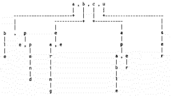

# Lexical Analysis Using Search Tries

**John W. M. Stevens**

*John Stevens is a graduate of Colorado State University with a bachelor's degree in computer science. He has worked at five different companies as a programmer and software engineer, writing everything from accounting programs for truck drivers to C compilers for high-speed parallel computers. He is currently working for Space Tech as a compiler writer.*

---

Recently, there has been a lot of talk about an old UNIX idea, that of user programmability. User programming presents some drawbacks, not least of which is the absence of a standard language. Each new program requires the user to learn a new language (unless the new program is a clone of another). Also, though different user languages may have similiar syntax, they may not interpret a statement the same way. In addition, user programming languages have, until just recently, been cryptic and difficult to learn.

## Language Interpreters

To create a program that is user-programmable requires that the software engineer know how to design, write, and maintain a language interpreter. Such arts are taught in most computer science curriculums. A language interpretation system contains three basic components: the lexical analyzer, the parser, and the interpreter.

The first part of the system, the lexical analyzer, takes ASCII input, separates it into words, and converts those words to numeric values, called *tokens*. Words that have special meaning in the language are called *keywords*. Punctuation characters, such as `;` and `:`, also have special meaning in the language and must be tokenized as well. The lexical analyzer determines if the input contains illegal words or punctuation characters.

While the lexical analyzer breaks the input text into words, it does not determine whether the words are arranged into legal sentences. This is the job of the parser. The parser takes a stream of tokens from the lexical analyzer and attempts to determine if they form a stream of legal sentences according to the language's grammar. A grammar consists of a set of rules that describe all legal sentences possible in the language. Not all legal sentences make sense. In most programming languages, the parser will accept legal sentences that the interpreter cannot understand or execute.

Once the parser has decided that the token stream forms legal sentences, the interpreter combines the operations of semantic analysis and program execution. Semantic analysis determines what operations the program is telling the interpreter to execute. Execution is the operation of reading program tokens and translating them into a series of machine language function calls that instruct the CPU what to do. Interpreted languages execute slower than compiled languages, in part, because the interpreter must translate each program sentence into machine language every time it is executed. Sentences from compiled programs are already translated into machine language.

## Lexical Analyzers And Search Tries

To facilitate the construction of lexical analyzers, I use a special class of search tree, called a *trie*. A trie is a tree data structure that allows strings with similiar character prefixes to use the same prefix data and store only the tails as separate data. One character of the string is stored at each level of the tree, with the first character of the string stored at the root, and the last character of the string stored at a sub-tree node or in a leaf node. Figure 1 shows how a trie would store the following collection of words: ape, append, able, bee, bearing, cape, caper, capable, us, use and user.



Tries used for lexical analysis store token values with each character in the trie, as shown in Listing 1:
```c
typedef struct key_st {
    char   c;                /* String character.           */
    TKNS   token;            /* Token value.                */
    struct key_st *child;    /* Pointer to sub-trie.        */
} NODE;
```

Most of the token values are zero, indicating *ILLEGAL KEYWORD*. The token value of the last character of each legal word is the token value for that word. For example, in Figure 1, the `struct` for the letter *e* in the trie branch under the letter *u* stores the token value for the word *USE*. The letters *s* and *r* in the same branch would have the tokens *US* and *USER* stored with them, respectively.

Using a trie in a lexical analyzer combines the operations of breaking the input text into words and determining whether or not the words are legal for the language. This scheme imposes language design constraints on the engineer, since words do not have to be delimited to be recognized. The constraint is either to design a requirement for delimitation into the language definition or to ensure that no two adjacent words of the language can ever be combined to make a longer, legal word of the language.

## Static Tries In C Arrays

I prefer to store my tries as static data in the same file as the code for the lexical analyzer. This arrangement allows each program to use more than one lexical analyzer, as well as eliminates the need for external files. On the other hand, tries have a widely variable number of elements per trie level, making it imperative to use a dynamically-sized data structure. The method I adopted stores each level of the trie as a uniquely named array with elements corresponding to the structure in Listing 1.

Storing tries as source code in the lexical analyzer can make for very large source files. Even a small language can have a search trie that is 1100 lines of source code. Such a file compiles to a relatively small amount of data, but just as no program is ever fast enough, no program is ever small enough either. Roughly half to two-thirds of the memory that a trie uses is for storing pointers to sub-tries. To minimize the memory requirements of a search trie after compilation, you should exploit your compiler's options to group data together. Doing so lets you use a smaller pointer size to reference that data.

In order to make creating and maintaining lexical analyzers that use tries easier, I've written a program that accepts a text file of token words and token define names, creates the trie in memory, and dumps the trie to standard out as static C data arrays. This scheme facilitates adding or deleting a word from the trie.

## Example Lexical Analyzer

The example lexical analyzer uses a trie that contains the keywords and token values defined in Listing 2:
```
(           L_PAREN
)           R_PAREN
,           COMMA
/           F_SLASH
action      ACTION
after       AFTER
and         AND
archive     ARCHIVE
attributes  ATTRIBUTES
before      BEFORE
directory   DIRECTORY_T
exec        EXEC
files       FILES
hidden      HIDDEN
label       LABEL
modified    MODIFIED
name        NAME
not         NOT
or          OR
print       PRINT
readonly    READONLY
recurs      RECURS
search      SEARCH
select      SELECT
system      SYSTEM
{           L_BRACE
|           BAR
}           R_BRACE
```

The first word on the line is the keyword, and the second word is the token value enumeration label for that keyword. The trie creation program processes this file. The program output is captured in a file that will be included in the source code file for the lexical analyzer.

[Listing 3](listing3.c) contains the token value enumeration, function prototypes, and type definitions necessary to use the lexical analyzer. To increase the readability of the parser source code, I've selected enumeration labels that are as similar as possible to the keywords they represent. Because of name space collision with type and/or define names used by the C compiler, some of the enumeration labels are postfixed with the `_T`.

[Listing 4](listing4.c) contains the lexical analyzer. I've extracted this code from a program that acts as a user-programmable file selection shell. The function `OpenPrg()` initializes the lexical analyzer by opening the file that contains the source code to be analyzed. The parser then calls the function `Lex()` repeatedly to get tokens. Each time `Lex()` is called, it begins by reading and throwing away both white space characters (space, tab and newline characters) and comments. When the first character of a suspected keyword is found, it breaks out of the loop and attempts to get either a string constant, integer constant, time, or date.

If the input is not a constant of some type, the trie search function is called. The function `TrieSrch()` begins by attempting to find the input character in the trie node. `TrieSrch()` accepts a pointer to a node of a trie, a character to search for, and a pointer to a buffer for storing the word read from the input file. The function uses a binary search because the characters in a trie node are stored in sorted order.

If the input character is found in the trie node, `TrieSrch()` saves it in the word buffer. If the matching character in the trie node has a pointer to a child trie node, `TrieSrch()` reads another character from the file and calls itself recursively. If the return value from the recursive call indicates that the character was not found, `TrieSrch()` assumes that the input character for this call was the last character of a legal word and unreads the character read for the recursive call. The token value of the input character to this call is returned.

If the matching character does not have a pointer to a child trie node, the keyword buffer is *NUL*-terminated and the token value stored with the matching character is returned. If the input character is not found in the trie node, `TrieSrch()` *NUL*-terminates the keyword buffer and returns a value indicating that the character was not found.

Figure 2 presents an algorithm in structured English for separating words from an input character stream and searching for them in a search trie.
```
1) Read a character from the file.
   Call step 2 with the pointer to the root of the trie, the
   character read and a pointer to the begining of the key word
   save buffer.

2) Search for the input character in the current node of the trie.
   If the input character is found in the trie then
       Save the input character in the key word save buffer.
       Attempt to read a character from the file.
       If End of File then
           Return End of File.
       If the character found has a child trie pointer then
           Call Step 2 with the child trie pointer, the character
           read from the file and a pointer to the next byte in the
           key word save buffer.
       If the return value from the call to step 2 is NOT FOUND then
           Unread the character read from the file
           Return the token value stored with the input character
           of this call.
       else
           Return the return value of the recursive call.
   else If the character is not found then
       Save a NUL in the key word save buffer.
       Return the value NOT_FOUND.
```


## Summary

A trie is probably not the most efficient data structure for determining the legality of an input word. A sorted table of strings searched with a binary search would probably be faster and more memory efficient.

So why use a trie if it isn't as fast or efficient as other methods? Since the hardest part of writing a lexical analyzer is in breaking an undifferentiated stream of input characters into words, the beauty of a trie is that it groups characters into words and determines their legality at the same time. It is also, in my opinion, a more elegant solution. This alone is reason enough for me to use a trie.
