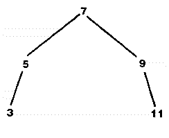
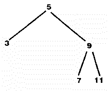
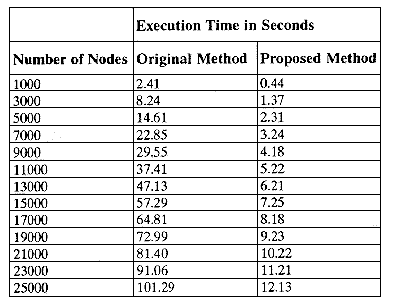
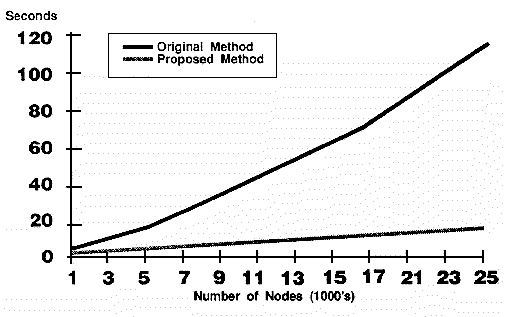

# An Efficient Method for Optimizing Binary Trees

**David W. Schwartz**

*David W. Schwartz is an undergraduate student in Computer Science and Economics at Oklahoma State University. He works in Systems Design for Dimensional Concepts Inc., a company specializing in hospital Medical Records software. He can be reached by mail at Oklahoma State University, c/o Dr. M. Samadzadeh, 219 Math Sciences, Stillwater, OK 74078.*

---

A binary tree is a data structure used to store dynamic, ordered data. The distribution of data within a binary tree greatly influences the efficiency of operations on the tree: the more unbalanced the tree, the less efficient the data access. Through normal use (i.e., additions and/or deletions), a binary tree will generally become unbalanced. Therefore, it is desirable to optimize the binary tree periodically to maximize execution time efficiency.

Many techniques have been devised to prevent trees from becoming unbalanced, including AVL trees, red-black trees, and 2-3 trees. These methods generally complicate the simple insert, delete, and access routines available with standard binary trees. They also generally incorporate the need for additional memory in each node.

It is possible, however, to optimize a binary tree *after* construction using an algorithm as short and simple as the ones used to create and access it. First, the tree is formed into a linked list through a standard in-order traversal. The tree can then be reformed into its optimally-balanced configuration with a simple recursive function.

This solution allows all access routines to be concise and simple, uses no extra data space, and saves time by not balancing a tree when speed is needed most, i.e., when the tree is in use.

## Origin

In his article "Optimizing Binary Trees" (Terry, 1991) the author suggests rebalancing a tree only periodically, by first flattening the tree into a linked list (the least speed-efficient case), then "folding" the tree in half, forming two subtrees, which can then also be folded recursively. This process yields the optimum arrangement for the tree.

In Terry's algorithm, the only exception to the folding process appears when a subtree contains exactly five nodes. Under the normal process of folding, the subtree in Figure 1 would result:



Note that if the values in the five nodes are close together, it becomes impossible to add new nodes except at the extreme edges of the tree, thus extending the tree to three levels. If the tree is arranged as in Figure 2, any value less than 3 can be added without extending the tree:



To avoid such sparsely filled trees, Terry always positions the short side of the subtree toward the outside of the parent tree.

His routines are also generic, i.e., they work on any standard binary tree, without knowing what data it contains. His routines require only that each node have the pointers to its branches at a predictable location in the node. The easiest way to meet this requirement is to place the pointers at the beginning of the node; any tree whose node structure begins as follows can be optimized:
```c
struct treenode {
   struct treenode *left;
   struct treenode *right;
...
};
```

## A Better Way

Although Terry's routine yields the optimal node arrangement for any given tree, it includes many counterproductive movements. If a tree contains `N` nodes, each time the routine folds the tree, it must alter `O(N)` of the nodes. The tree must be folded approximately <code>log<sub>2</sub>(N)</code> times, yielding a total of <code>O(N * log<sub>2</sub>(N))</code> alterations to complete the process. It is possible to achieve the same result with code that is smaller, faster, and makes only `2N` or `O(N)` alterations in the tree. (For an empirical timing comparison of the two methods, see the sidebar entitled "[Timing Comparison](#timing-comparison)".)

First, the tree must be formed into a linked list through a standard in-order traversal. Then the tree is reformed into its optimally-balanced configuration with a simple recursive routine ([Listing 1](listing1.c)). The tree passed to this routine is assumed to have two pointers as the first elements in the node. Data in the node is inconsequential to this discussion. The tree is also assumed to use `NULL` pointers as terminators on the leaf nodes. Thus, a program can use these routines by simply passing a `void` pointer to `optree` and replacing the old root with the return value. A program need only execute the following line of code to optimize any binary tree:
```c
root = (struct treenode *) optree((void *)root);
```

## The Code

Of the code necessary for the optimization (see [Listing 1](listing1.c)), the only routine available to other source files is `optree` (from "optimize tree"). It serves as the entry point for the module and takes only a single parameter, a pointer to the root of the tree to be optimized. The `optree` function initializes the pointers for the linked list and then calls the routine to form the tree into a linked list, `list_build`.

The `list_build` function is a modified in-order traversal of the tree. It traverses the tree attaching each node to the end of a list and counting how many nodes are placed in the list. This count later determines how many nodes are in the tree and how the tree should be subdivided optimally. When `list_build` completes, `optree` begins the optimization process by resetting the `left` variable, to indicate that the tree currently leans to the right, and then calling the recursive optimization routine, `form_tree`.

The `form_tree` function works much like a recursive node-counting routine turned upside down. A node-counting routine would call itself to find the number of nodes in the left subtree, add one for the current node, and call itself to find the number of nodes in the right subtree. Conversely, `form_tree` receives as a parameter the number of nodes that should be included in the newly-constructed tree. To construct the appropriate tree, `form_tree` determines how many nodes belong in the left subtree, calls itself to remove that number of nodes from the linked list, removes a node from the list for itself, and then calls itself again to remove the rest of the nodes (the right subtree) from the list. The recursion terminates when `form_tree` is asked to construct a tree with fewer than one node (namely, a `NULL` tree).

The only complexity in the algorithm involves calculating how many nodes belong in each subtree. If the number of nodes to be divided between the two subtrees is odd, the extra node should be put in the subtree that is closer to the center of the current node's parent. If the current node is a left child of node X, the extra node should go into the right subtree of the current node. This arrangement forces the shortest paths to the outside of the tree, where data is most likely to be added.

The special five-node case (in which the subtree is unevenly divided, as in Figure 2) is also considered in calculating the number of nodes that belong in each subtree. Note that when folding a five-node tree, the desired effect can be achieved by simply moving the fold one node too far from the center of the parent tree. That is, instead of dividing the nodes so that there is one more node in one subtree than in the other, simply divide it so that there are two more nodes in one subtree than in the other. Thus handling the five-node case requires only the following line of code:
```c
if (num == 5) middle++;
```

## External Variables

There are five global variables in [Listing 1](listing1.c). The decision to make these variables global was not reached arbitrarily. The globals are all `static` and thus protected from other modules. The `list_base` variable is global so that one node with a right pointer can be placed on the list before recursion begins. This eliminates the need to check for a `NULL` header each time the function is entered, thus increasing efficiency and decreasing code size. The other four globals are used by multiple levels of recursion, although only one copy of each is necessary. If these variables had not been global, some routines would have required several extra parameters. Excess parameters consume scarce stack space and add expensive pointer references. Consequently, the drawbacks usually associated with the use of global variables are overshadowed by the compactness, efficiency, and clarity they provide here.

## Sorted Data

One disadvantage to binary trees is that when adding sorted data they degenerate into linked lists and exhibit worst case behavior. The proposed optimization algorithm addresses this limitation in two ways. First, the optimization algorithm can conveniently "fix" any binary tree that has suffered the effects of sorted data previously added. Second, with only a small modification the algorithm can add sorted data to a tree as quickly and conveniently as the data's sorted nature warrants! Since a large volume of sorted data would normally only be added in batch processing, it could be done easily as part of the optimization process.

During optimization, the tree is initially formed into a linked list. The sorted data is already in some form of a list (or it cannot be considered sorted). The two lists merge easily and quickly into a single list. This list becomes a balanced tree when given to the optimization function. Thus, adding a large volume of sorted data results in optimal performance, not worst-case performance.

## Possible Problems

Perhaps the most obvious problem with the routines presented here lies in the tendency of `list_build` to cause a stack overflow when flattening a large, badly degenerated tree. A non-recursive in-order traversal algorithm, which can be found in many computer science textbooks, will solve this problem. [Listing 1](listing1.c) uses a recursive approach in the interest of simplicity and brevity.

The `form_tree` function should not need to be rewritten to avoid recursion. Nearly all implementations of C allow for enough levels of recursion to optimize millions of nodes. A well-optimized binary tree of height 32 can contain over four billion nodes, many times the number of nodes normally expected in a binary tree.

## Conclusion

Any implementation of a binary tree can benefit from having the data in the tree redistributed evenly. The routines presented here provide a means to achieve the most speed-efficient distribution of the data, without the complexities involved in balancing the tree as it is growing and shrinking. The standard routines for manipulation of binary trees are renowned for being small, easy to understand, and fairly efficient. Every attempt was made to keep the optimization routines within that tradition.

The optimization routines presented here are a significant improvement over the routines presented by Terry (1991) which inspired their creation. When compared to the original routines, these routines:
* are smaller – they compile to smaller executable code and take fewer pages to list;
* are easier to understand – only one function is necessary to rebuild a tree from a list;
* require less stack space – fewer parameters are used for the recursive functions; and
* execute faster.

## Bibliography

Terry, Bruce. June 1991. "[Optimizing Binary Trees](../../09.06/terry/terry.md)." *The C Users Journal*, 65-74.

---

## Timing Comparison

In these tests, a small program, which adds the same random numbers to each of two binary trees, optimizes each copy of the tree 30 times. (Since the tree is initially flattened and then rebuilt, rebuilding a balanced tree should take just as long as rebuilding a degenerate one.) Thirty repetitions was deemed to be sufficient to cancel any round-off or timer errors. Table 1 gives the time needed for each routine to complete its optimizations:



Figure 3 is a graphical representation of the data in the table:


