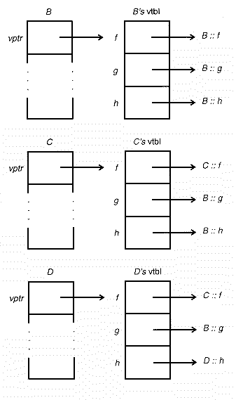

# Stepping Up To C++: How Virtual Functions Work

**Dan Saks**

*Dan Saks is the founder and principal of Saks & Associates, which offers consulting and training in C++ and C. He is secretary of the ANSI and ISO C++ committees. Dan is coauthor of C++ Programming Guidelines, and codeveloper of the Plum Hall Validation Suite for C++ (both with Thomas Plum). You can reach him at 393 Leander Dr., Springfield OH, 45504-4906, by phone at (513)324-3601, or electronically at dsaks@wittenberg.edu.*

---

Last month, I introduced virtual functions. (See “[Stepping Up to C++: Virtual Functions](../../11.12/saks/saks.md)”, *CUJ*, December 1993). I outlined how you might use virtual functions to implement a device-independent file system, and showed in detail how to create a class of geometric shapes with polymorphic behavior. I continue this month by explaining the mechanics of how virtual functions work. But first, a brief recap of the key concepts.

Public inheritance in C++ defines an Is-A relationship between a derived class and its base. That is, given the definition
```cpp
class D : public B { ... };
```
`D` is publicly derived from `B`, and any `D` object is also a `B` object. A function that expects a pointer (or reference) to a `B` object as its formal parameter will accept a pointer (or reference, respectively) to a `D` object as well.

More generally, converting a pointer to a `D` object into a pointer to a `B` object is a standard conversion that does not require a cast. For example, if `D` is an object of class `D` and `B` is a public base class of `D` you can write
```cpp
B *pb = &d;
```
which converts `&d` (an expression of type `D*`) to `B*`. Binding a `D` object to a `B&` is also a standard conversion.

When discussing the behavior of pointers to base and derived objects, it helps to distinguish the static type of an object from its dynamic type. The static type of an object is the type of the expression used to refer to that object. The dynamic type of an object is its “actual” type – the object’s type at the point where it was created.

For example, using `pb` as defined and initialized above, `*pb` has static type `B` but dynamic type `D`. Or, given
```cpp
B &rb = d;
```
`rb` has static type `B` but dynamic type `D`. The static type of `*pb` is always `B`, but its dynamic type may change during program execution. For example, if `B` is a `B` object, then
```cpp
pb = &b;
```
changes the dynamic type of `*p` to `B`.

A derived class inherits all the members of its base class. A derived class cannot discard any members it inherits, but it can override the definition of an inherited member function with a new definition.

In C++, non-static member functions are non-virtual by default. C++ resolves non-virtual member function calls by static binding. That is, if `pb` is declared as a `B*`, and `B` has a non-virtual member function, then `pb->f` always calls `B`’s `f`. Even if, at the time of the call, `pb` actually points to a `D` object (where `D` is derived from `B` and overrides `f`), calling `pb->f` still invokes `B`’s `f`, not `D`’s `f`.

On the other hand, virtual member function calls bind dynamically. If `pb` is a `B*` and `f` is declared as a virtual member function in `B`, then calling `pb->f` calls `f` associated with the dynamic type of `*pb`. Thus, if `pb` actually points to a `B` object, then `pb->f` calls `B`’s `f`. But, if `pb` actually points to a `D` object (where `D` is derived from `B` and overrides `f`), then `pb->f` calls `D`’s `f`.

A class with at least one virtual member function is called a polymorphic type, and objects of such type exhibit polymorphism. Polymorphism lets you define a single interface for a hierarchy of subtypes that exhibit logically similar, but physically different, behavior. Using polymorphism, you can pass pointers or references to objects of a derived class type to functions that know the object only by its base class type. Yet, the object retains its dynamic type so that member function calls applied to that object invoke the derived class behavior.

[Listing 1](shape1.h) shows the class definition for `shape`, a polymorphic class for geometric shapes that I described last month. [Listing 2](shape2.h) shows the corresponding member function and static data member definitions. Class `shape` has three virtual functions, `area`, `name` and `put`, and two non-virtual functions, `color` and `shape` (a constructor). [Listing 3](circle.h) and [Listing 4](rectangl.h) show the complete definitions for classes `circle` and `rectangle`, respectively, both derived from `shape`. Each derived class defines it own constructor (constructors are not inherited), and also overrides each of its inherited virtual functions with appropriate definitions.

[Listing 5](largest.cpp) contains a function that illustrates the power of polymorphism. Function `largest` locates the shape with the largest area from a collection of shapes. Since `shape` is a polymorphic type, calling `sa[i]->area` returns the area of a shape without the caller ever knowing exactly what kind of shape `*sa[i]` really is.

## vptrs and vtbls

Both the ARM [1] and the emerging C++ standard take pains to describe the behavior of virtual functions, as well as the rest of the C++ language, without suggesting any particular implementation strategy. However, the ARM does describe implementation techniques in the commentary at the end of chapter 10 on derived classes. I find that relying on a model implementation simplifies the description of many details of the behavior of virtual functions. The following is one such model.

Typical C++ implementations add a single pointer to each object of a polymorphic class. That pointer is called a *vptr* (pronounced “VEE-pointer”). Whenever a constructor for a polymorphic class initializes an object, its sets that object’s *vptr* to the address of a table of function pointers called a *vtbl* (“VEE-table”). Each entry in the *vtbl* is the address of a virtual function. All objects of a given class share the same *vtbl*; that *vtbl* contains exactly one entry for each virtual function in that class.


For example, Figure 1 shows the layout for an object of class `shape` (as defined in Listing 1) along with its corresponding *vtbl*. Every `shape` object has the same two fields in the same order: a `vptr` and a `_color` data member. The `vptr` points to `shape`’s *vtbl*, which contains the addresses of the virtual functions `shape::area`, `shape::name` and `shape::put`. The non-virtual functions `shape::color` and `shape::shape` (the constructor) don’t use any space in the *vtbl*, nor in the object itself.


Figure 2 and Figure 3 show the layouts for `circle` and `rectangle` objects, respectively (as defined in [Listing 3](circle.h) and [Listing 4](rectangl.h), respectively), along with their corresponding *vtbl*s. Notice that the initial portions of both `circle` objects and `rectangle` objects are `shape` objects, so a pointer to a `circle` or a `rectangle` is a pointer to a `shape`, and the conversion from `circle*` or `rectangle*` to `shape*` requires no pointer arithmetic.

The *vtbl*s for both derived classes have their function pointers in the same order as the *vtbl* for the base class, although the pointer values differ. For example, the *vtbl* entry for the `area` function is always first in every class derived (directly or indirectly) from shape. The *vtbl* entry for `name` is always second, and the entry for `put` is always third.

Whereas a non-virtual function call generates a call instruction that refers directly to the function’s address as determined during translation (compiling and linking), a virtual function call generates additional code to locate the function’s address in the *vtbl*.

The ARM suggests viewing a *vtbl* as an array of function addresses, so that each call locates the called function by subscripting into the *vtbl*. For example, if `ps` is a pointer to a `shape`, then
```cpp
a = ps->area();
```
translates into something like
```cpp
a = (*(ps->vtbl[0]))(ps);
```
and
```cpp
ps->put(cout);
```
translates into
```cpp
(*(ps->vtbl[2]))(ps, cout);
```

An expression of the form `ps->vtbl[n]` is the `n`th entry in the *vtbl* of the object `*ps`, so `(*(ps->vtbl[n]))` is the `n`th virtual function itself. Actually, in C++ as in C, you need not explicitly dereference a pointer to a function in a call expression. Thus you can write
```cpp
(*(ps->vtbl[2]))(ps, cout);
```
as simply
```cpp
(ps->vtbl[2])(ps, cout);
```

Each virtual function may have a different signature (sequence of formal parameter types) and return type. So strictly speaking, you can’t implement *vtbl*s as arrays of pointers because an array requires all its elements to have the same type. For example, `shape::area` has type `double (*)()` and `shape::put` has type `void (*)(ostream&)`.

I prefer to model a *vtbl* as a struct in which all the members are pointers to functions. For instance, you can define the struct type for a *vtbl* for shapes as something like
```cpp
struct shape_virtual_table
    {
    double (*area)();
    const char *(*name)();
    ostream &(*put)(ostream &os);
    };
```
and define the actual `shape` *vtbl* as something like
```cpp
shape_virtual_table shape_vtbl =
    {
    &shape::area,
    &shape::name,
    &shape::put
    };
```
Similarly, you can define the `circle` *vtbl* as something like
```cpp
shape_virtual_table circle_vtbl =
    {
    &circle::area,
    &circle::name,
    &circle::put
    };
```

(I say “something like” because this code won’t actually compile. The code only demonstrates the general layout of the *vtbl*s.) Using this translation model,
```cpp
a = ps->area();
```
translates into
```cpp
a = (*ps->vtbl->area)(ps);
```
or simply
```cpp
a = ps->vtbl->area(ps);
```
and
```cpp
ps->put(cout);
```
translates into
```cpp
(*ps->vtbl->put)(ps, cout);
```
or just
```cpp
ps->vtbl->put(ps, cout);
```

A virtual function call with `n` arguments translates into a call (through a *vtbl* entry) with `n + 1` arguments. The additional argument is always the address of the object to which function applies; in the examples above, its value is always `ps`. The additional argument becomes the value of `this` inside the called function. Virtual functions cannot be static members, so they always have an implicit `this` argument.

Bear in mind that I’m describing only a typical implementation strategy. ([2] describes a similar implementation of virtual method tables generated with the aid of macros that support object-oriented programming in C.) C++ translators may implement virtual functions somewhat differently, but the effect must be the same. The *vptr* need not be at the beginning of each polymorphic object. But, for any class `D` derived from polymorphic class B, `D`’s *vptr* must be at the same offset within `D` as `B`’s *vptr* is within `B`. Similarly, the function pointers in the *vtbl* need not be in the same order as the virtual function declarations in the class. But, for any `D` derived from a polymorphic `B`, the initial portion of `D`’s *vtbl* must have the same layout as `B`’s *vtbl*, even if `D`’s actual pointer values differ from `B`’s because `D` has overridden some of the virtual functions it inherited.

In short, a C++ translator must insure that the base subobject of any derived object has the same layout as any other object of the same base type, and the base portion of a derived class *vtbl* must have the same layout as the base class *vtbl*. Hence, a translator need not see the declarations for any derived classes when translating a virtual call. Regardless of `p`’s dynamic type, a virtual call such as `p->f` always translates into code to
* construct `f`’s actual argument list
* follow `p`’s *vptr* to a *vtbl*
* transfer control to the function whose address is in the *vtbl* entry corresponding to `f`.

All polymorphic objects with a given dynamic type can share the same physical *vtbl*. Some C++ implementations actually manage to eliminate duplicate *vtbl*s. Others produce multiple copies of *vtbl*s, either due to limitations of the development environment or to provide better system performance. Many implementations offer compiler and linker options to let you decide.

This implementation model shows that virtual functions introduce a small cost in both space and time:
* Adding one or more virtual functions to a class that previously had none adds a *vptr* to each object of that class.
* Each polymorphic class adds at least one more *vtbl* to the program’s data space.
* Every constructor for a polymorphic class must initialize a *vptr*.
* Every virtual function call must locate the address of the function by looking in a *vtbl* (requiring typically 2 to 4 additional machine instructions).
* In C++, member functions are non-virtual by default because C++ tries to adhere to the principle that “you don’t pay for what you don’t use”. If you’re willing to pay for a virtual function call, you must say so explicitly.

## Selective Overriding

A derived class may override all, some, or none of the virtual functions in its base class. A derived class inherits the function definitions for all virtual functions it does not override. [Listing 6](override.cpp) and Figure 4
together illustrate the effects of selectively overriding only some of the virtual functions inherited from a base class.



[Listing 6](override.cpp) shows a simple class hierarchy and Figure 4 shows the corresponding *vtbl*s. Class `B` defines three virtual functions, `f`, `g`, and `h`. Class `C` derived from `B` overrides only function `f`, so the entries for `g` and `h` in `C`’s *vtbl* continue to point to `B`’s `g` and `h`. Class `D` derived from `C` overrides only function `h`, so the entries for `f` and `g` in `D`’s *vtbl* are the same as in `C`’s *vtbl*. Since neither `C` nor `D` overrides `g`, all three *vtbl*’s have the same value for `g`’s entry, namely `B`’s `g`.

In [Listing 6](override.cpp), `pc` has static type `C*`. But by the time program execution reaches the declaration
```cpp
B &rb = *pc;
```
`pc` has dynamic type `D*`. Thus all the calls applied to `rb` use `D`’s vtbl.

## Pure Virtual Functions

Sometimes when you design a type hierarchy, you find that you don’t want to create the hierarchy’s base class object. Rather, the base class serves only as the specification for a common interface for objects of types derived from it.

For example, in a hierarchy that implements a device-independent file system (such as the one I sketched in my last column), the base class `file` defines the properties common to all `file` types. The derived classes define specific `file` types, like `disk_file` or `tape_file`, that are types for the real-live file objects in the system. But there is no such thing as a `file` that is not a `disk_file`, or a `tape_file`, or some other device-specific `file`. The base class only specifies the common `file` interface.

In my shape hierarchy, I never really wanted to create objects whose dynamic type is `shape`. Class `shape` is only supposed to define the common properties for shapes. I implemented class `shape` so that objects of that type appear to be points, not because I needed a shape that’s a point, but because I hadn’t yet presented a way to avoid defining the function bodies for virtual functions. In fact, with early C++ dialects, you had no choice but to define phony function bodies. Now you can simply declare the functions as pure virtual functions.

You declare a function as a pure virtual function by adding the pure virtual specifier `= 0` at the end of the function declaration. [Listing 7](abshape.h)
shows the definition for class `shape` with `area`, `name`, and `put` as pure virtual functions.

A base class with at least one pure virtual function is called an abstract base class. You cannot declare objects of an abstract base class. However, you can declare pointers and references to an abstract base class:
```cpp
shape s;             // error
void f(shape *ps);   // ok
shape &rs;           // ok
```

If a derived class does not override every pure virtual function in the base class with an “impure” virtual function, then the derived class is also an abstract base class. For example, class `D` in [Listing 8](derived.h) is an abstract base class because it fails to override pure virtual function `g` with a function definition.

In the model implementation, the *vtbl* entry for a pure virtual function is a null pointer.

## References

1. Margaret A. Ellis and Bjarne Stroustrup. *The Annotated C++ Reference Manual*. Addison-Wesley.
2. Gregory Colvin. “[Extending C for Object-Oriented Programming](../../11.07/colvin/colvin.htm)”, *The C Users Journal*, Vol. 11, No. 7, July 1993.
