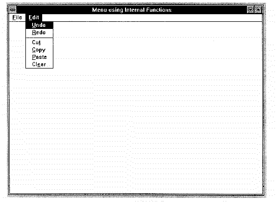

# An Alternative to Large Switch Statements

**Matt Weisfeld**

*Matt Weisfeld currently works for the Allen-Bradley Company in Cleveland, Ohio developing software for UNIX, VMX, DOS, Windows and other platforms. The author has recently published a book, entitled Developing C Language Portable System Call Libraries, which is available from the WILEY-QED group of John Wiley&Sons. Matt can be reached via Compuserve [71620,2171] or Internet [maw@ferrari.da.hh.ab.com].*

---

After many years of writing structured C code, I find it difficult to adjust to many aspects of Windows programming. The enormous size of many Windows program `switch` statements makes me particularly uncomfortable. Given the event-driven nature of Windows, I can understand why these statements grow so large, but my instincts tell me to avoid creating such constructs as a general practice. Just imagine a menubar/pulldown menu structure with 50 potential choices generating 50 possible messages (the Borland C++ for Windows 3.1 compiler environment has over 60). If I create such a menu via the traditional approach my resulting `switch` statement will contain 50 `case` statements. That makes for pretty hard-to-read code. In this article I demonstrate how to replace these gigantic `switch` statements with something more manageable.

## An Alternative

As an alternative to the `switch` statement, I use a function table with a look-up routine. This routine uses the parameter (formerly the `switch` statement’s control variable) as a search value. When the routine finds a key in the table matching the search value, it executes the function associated with the key.

I create the internal function table with the following prototype:
```cpp
typedef struct {
    WPARAM message;
    int (*funcptr)(HWND);
} INFUNCS;
```

The first field in the structure, defined as type `WPARM`, corresponds to the argument of the same type obtained from main Windows message loop. The second field is a function pointer to a routine. In this example, the parameter in the internal function call, a window handle (`HWND`), indicates where to display a messagebox. (The actual type and number of arguments passed in a real application will be different, depending on the application.)

As an illustration, consider a Windows application, called *internal*, which creates a single window (I use the BORLAND C++ Compiler v3.1; however, this technique is not compiler dependent). This window has a simple menu structure providing two choices on the menubar, FILE and EDIT. Selecting either of these options produces a pulldown menu that contains the actions available to the user (FILE has eight, EDIT has six).



Figure 1 shows a sample window with the EDIT pulldown menu activated. Choosing one of these pulldown items, using either the mouse or the keyboard, sends a `WM_COMMAND` message to the program message loop. After recognizing `WM_COMMAND`, the code checks the `wParam` argument for the actual message type, which represents the menu choice.

After encountering a `WM_COMMAND` message, a simple table search attempts to match the `wParam` value to its counterpart in the table. If found, the code calls the corresponding internal function. If not found, the code generates a messagebox displaying an internal error. This error should theoretically not occur unless a legitimate `wParam` value is not in the table. (In this case, you can simply add the missing value to the table.)

The code for all the internal functions resides in `funcs.c` (see [Listing 7](FUNCS.C)). The routine for `p_file_open` looks like this (the others are almost identical):
```cpp
int p_file_open(HWND hwnd)
{
 MessageBox (hwnd, "file_open", "COMMAND SELECTED", MB_OK);
 return(0);
}
```

The initialization of the function table, called `infuncs`, is specified in the file `funcs.h` (see [Listing 5](FUNCS.H)). An abbreviated example of the table definition looks like this:
```cpp
INFUNCS infuncs[] = {
    {WM_FILE_NEW,    p_file_new},
    {WM_FILE_OPEN,   p_file_open},
    ...
    {WM_EDIT_CLEAR,  p_edit_clear},
    {NULL,           NULL},
};
```

## Code Comparison

The complete code for the main procedure resides in the file `internal.c` (see [Listing 6](INTERNAL.C)). The code to perform the table search, and thus replace the `switch` statement, is as follows:
```cpp
case WM_COMMAND:
{
for (i = 0; infuncs[i].message != NULL; i++) {
    if (infuncs[i].message == wParam) {
      status = (*infuncs[i].funcptr)(hwnd);
      break;
    }
}

if (infuncs[i].message == NULL) {
    MessageBox (hwnd, "Bad Message", "INTERNAL ERROR", MB_OK);
    break;
}
}
```

The algorithm performs a sequential search that terminates when a message matches an entry in the table (by a `break` statement) or when the search reaches the `NULL` value (meaning the message was not in the table, an error as described earlier). Compare this code to the `switch` statement in [Listing 3](UGLY.C). Even though the `switch` statement contains only 14 `case` statements, the function table still provides a code savings.

## Performance Considerations

It is true that this technique introduces overhead in the form of table searches and function calls. I was initially concerned that this approach would degrade performance beyond the limits of acceptability. However, discussion on the BORLAND forum of Compuserve provided a consensus that there should be no performance problems relative to `switch` statements. I don’t expect performance to suffer compared to `switch` statements because the compiler usually treats a large `case` statement as a table look-up anyway, and function calls require very little overhead. However, there is no easy way of predicting how this technique will impact a specific application.

You can also speed up table searches by using smarter algorithms (see the sidebar, “[Choosing a Table Search Algorithm](#choosing-a-table-search-algorithm)). My sample application just uses a linear search – one of the slowest when it comes to large tables.

## Conclusion

Despite the added overhead, the compelling reason to abandon the `switch` statement is to enhance readability. When using `switch` statements, more messages require more `case` statements. When using internal functions, the addition of a message requires no change to the message processing code – only a new entry in the table and a new internal function. The utility gained by using internal functions greatly increases as the number of messages increases.

## References

1. *Data Structures, Algorithms and Program Style using C*, James F. Korsh and Leonard J. Garrett. PWS-Kent Publishing Company. Boston, 1988. p 358.
2. *Introduction to Data Structures with Pascal*, Thomas Naps and Bhagat Singh. West Publishing Company. St. Paul, 1986. p 317.
3. *Peter Norton’s Windows 3.1 Power Programming Techniques, 2nd ed.*, Peter Norton and Paul Yao. Bantam Books, 1992.
4. *Programming Windows, 2nd ed.* Charles Petzold. Microsoft Press, 1990.

---

## Choosing a Table Search Algorithm

Choosing the proper search algorithm can greatly impact the efficiency of a program. This is especially true as a table grows very large. For example, consider an array with `n` elements (size `n`, assume elements start at `1`). Each element of the array is a structure with the first field designated as the key. The search algorithm will compare a search value to each key in the table until it finds a match or the table is exhausted. I describe two types of search techniques here: the linear search and the binary search. (Hash tables are also an alternative to certain searching applications; however, they are mainly used for tables that are highly volatile or built at run time. The table in this article is fairly static and is built at compile time.)

## Linear Search

Linear searches are the simpler of the two and normally considered the least efficient. The search progresses in a linear fashion (i.e. table position `1`, position `2`, ... position `n`). Processing time increases linearly with `n`. As a measure of efficiency, I present figures in terms of number of accesses required:

| Case    | Complexity                                        |
|:--------|:--------------------------------------------------|
| Best    | `1` – a search for the first element in the table |
| Worst   | `n` – a search for the last element in the table  |
| Average | `n/2` – on average half the numbers are searched  |

A simple technique to eliminate a comparison step can increase the efficiency of a linear search by 20 to 50 percent. Most unimproved linear searches will require a simple comparison to limit the loop (ex: `if (i <= n)`) at each iteration. An improved algorithm elimates these comparisons by first placing a copy of the search value at location `n + 1`. The algorithm can now walk through the array without checking if it has exceeded maximum table size, since it is certain stop its search at location `n + 1`, if not before. If the search algorithm progressed as far as location `n + 1`, then the search value was not originally in the table.

It is also possible to order the array so that the most frequently accessed values are at the top of the table. However, this technique requires the program to keep statistics as the table is continuously searched, and to perform periodic re-ordering of the table.

## Binary Search

Binary searches are in many cases more efficient than linear searches. However, they have one major drawback: the table must be pre-sorted. Binary searches use the bisection method to search the table, much like a human looks through an alphabetized index. For example, if the table is of size `10`, the first element searched is at the mid-point `(1 + 10) / 2 = 5`. If element `5` is not a match, a simple comparison tells us whether the key is above or below element `5` (since the table is sorted). At this point half the table is eliminated from further consideration. If the value is greater than the key in element `5`, then the search is confined to locations `6` to `10`. The new mid-point is `(6 + 10) / 2 = 8`. This bisection process continues until either a match is made or the last element is searched. For a listing of the actual algorithm, consult the references provided. In this example, searching the entire table takes at most four iterations (compared to ten for the linear search). The access figures provided here assume that the bisection splits the remaining table into two parts that differ in size by at most one. The figures for binary searches are as follows:

| Case    | Complexity                                                                              |
|:--------|:----------------------------------------------------------------------------------------|
| Best    | `1` – a search finds the first mid-point searched in the table                          |
| Worst   | <code>log<sub>2</sub>n</code> – a search finds the last element searched in the table   |
| Average | <code>(log<sub>2</sub>n) - 1</code> –  if each element is searched with equal frequency |

## Comparing Linear and Binary Search

For large tables, the binary search requires much less time than the linear search in the worst case. Consider a table of 50,000 items. The worst-case scenario for a binary search requires no more than 16 accesses whereas the worst scenario for the linear search takes 50,000 accesses! In situations where the majority of searches are likely to fail, the efficiency of the binary search is very compelling. However, the logic of the binary search is much more complex (and thus much more time-consuming) than the logic of the linear search. Also, as already mentioned, the requirement for a sorted table is a drawback of the binary search. In this case, efficiency is impacted by the sorting method employed. Thus, for certain applications with small tables, the linear search may well be the faster of the two.

The volatility of the table also influences the choice of search technique. If the table is constantly being updated, then the sorts required by the binary search will occur with greater frequency, decreasing its efficiency relative to the linear search. However, if the table is static, then the sort is performed only once, thus increasing the attractiveness of the binary search.

In the context of the article, the size of the table is relatively small, so it might be best to use a linear search. Even in larger Windows applications, the number of `case` statements in a single `switch` structure will most certainly be less than 1000. However, the internal function table is very static and thus eliminates the primary objection to using a binary search.
