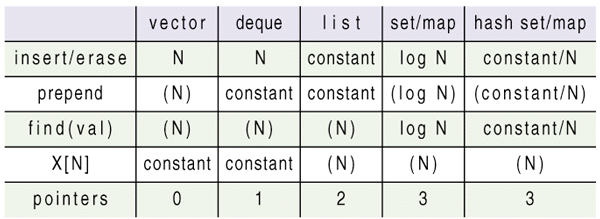

# Standard C/C++: Hash Tables

**P. J. Plauger**

*P. J. Plauger is Senior Editor of **C/C++ Users Journal** and President of Dinkumware, Ltd. He is the author of the Standard C++ Library shipped with Microsoft's Visual C++, v5.0. For eight years, he served as convener of the ISO C standards committee, WG14. He remains active on the C++ committee, J16. His latest books are **The Draft Standard C++ Library**, **Programming on Purpose** (three volumes), and **Standard C** (with Jim Brodie), all published by Prentice-Hall. You can reach him at pjp@plauger.com.*

---

Hash tables didn't make it into the C++ Standard, but they're too popular to ignore.

## Introduction

One of the great strengths of the Standard Template Library is the choice of containers it offers you. You can choose the set of tradeoffs that best suit your needs. For example:

* If you need fast random access to elements, but seldom insert elements into the controlled sequence, use a vector.
* If you need fast random access, but also need to freely add and remove elements at either end of the controlled sequence, use a deque.
* If you can live without fast random access, but need lots of flexibility in rearranging, inserting, and removing (erasing) elements, use a list.
* If you need reasonably fast lookup by key value, and equally reasonable insert and erase times, use a map or set.

I discussed the STL containers, as they have been incorporated into the C++ Standard, in a series of installments ending about a year and a half ago. (See "[Standard C/C++: Containers](../../14.12/plauger/plauger.md)", *CUJ*, December 1996, through "[Standard C/C++: Container Adapters](../../15.06/plauger/plauger.md)", *CUJ*, June 1997). Aside from some fairly minor tweaks, the visibile interface to these containers changed little by the time the C++ Standard was frozen in November 1997. An important change was the addition of more stringent requirements for exception safety in STL containers, as I described last month, but that had no real effect on the behavior of container member functions.

The containers required by the C++ Standard have one glaring omission – they include no form of hash tables. This may seem bizarre, considering the great popularity of hash tables in many branches of computing. As a matter of fact, hash tables were proposed on at least two occasions, after the original STL proposal was accepted into the draft C++ Standard in July 1994. Dave Musser, one of the original designers of STL, implemented them and submitted detailed specifications for them to the committee. But in a rare burst of conservatism, the committee twice decided not to add so much complexity to a draft that was already very large and running late.

As a result, practically every implementation of STL now includes Musser's hash tables, or some version derived therefrom. Nobody much cares that the C++ Standard doesn't require them. Programmers want them anyway.

I tend to be a purist about implementing programming-language standards. So until recently I've resisted the urge to add hash tables to my commercial implementation of the Standard C++ library. But even as I write these words, I'm negotiating with one very large customer to add hash tables to an upcoming release of their compiler. Lucky for me, I'd already succumbed to the temptation and written my own version of hash tables in the STL style. They still need a bit of refining, but I'm prepared to present the code in this installment, so you can see at least one way of doing the job.

## Hashing

Hashing is a trick. If you do it right, it lets you insert items in a table, and later access them, in much less time than you'd think possible. Consider first the simple approach of just appending each new item to the end of a list. You insert the new item in constant time, but the time to locate an item with a given key value grows linearly with the size of the list. A list with `N` elements takes, on average, `N/2` probes to locate a random key value. So we say that lookup is an order `N`, or linear, process.

You can speed up accesses slightly if you use a linked list and keep the elements ordered by key values. But then you have to spend more time inserting each new element – you have to walk the list until you find the proper spot to insert the element. And lookup time still grows linearly with `N`. One virtue of this approach is that you can more quickly find *all* elements that match a given key (assuming you want to permit such a multiplicity). They have to be adjacent if the list is kept in order by keys.

Hashing wins by chopping the list up into many smaller lists. You effectively make a table of `M` lists. With any luck, each list is close to `N/M` elements long. Where does the luck come from? It depends in large measure on the "hasing function" you choose – the function that maps an arbitrary key value into an index in the half-open interval `[0, M)`. The rest of the luck comes from the distribution of key values your program is presented with each time it runs. If the hash function does a good job or randomizing the particular distribution of key values, all the smaller lists are close to the average length `N/M`. Keep `M` big enough and you can keep the average access time small. Keep `M` roughly proportional to `N` and you can keep the average access time constant.

But what if your luck doesn't hold? The worst case occurs when every key value hashes to the same index value. The hash table degenerates into a single list of length `N`. You get the same time complexity as the simple approach we first considered above. Matters are slightly worse, in fact. The program is wasting all that space for the useless hash table. And it takes a little extra time computing the hash function to no advantage.

Designing effective hash functions has thus been a popular indoor sport among programmers for many years. I won't plumb the depths of this interesting topic, because it has little effect on the design of the containers presented here. Besides, these containers should be less sensitive to the choice of hash function for quite another reason. They are designed to grow incrementally.

Let me clarify. Typically, a hash function is tuned to the size of the hash table. As the table fills, the mean list length grows, and any lumpiness in the distribution of key values becomes ever more important. Beyond a certain point, a hash table gets too full to be effective. `N/M` becomes large enough to become a serious factor even if the key values are nicely distributed. At that point, conventional wisdom dictates that the program be prepared to allocate a larger hash table, with a different hash function to match, and "rehash" all the elements into the new table.

Obviously, it is a lot more complicated to design a container that traffics in multiple hash functions and the heuristics that determine when to rehash. Rehashing also introduces long delays, which can occur at inopportune moments, particularly in real-time or interactive code. It is clearly more desirable to avoid the baggage that rehashing introduces.

While reading up on Dave Musser's approach to making STL hash tables, I ran across a technique for rehashing in small increments. I described it recently in an article in *Embedded Systems Programming*, a sister publication to *CUJ*. (See "State of the Art: Hash It", *Embedded Systems Programming*, September 1998.) Go read that description if you can't figure out the technique from the code presented here.

## Hashing

In STL terms, a hash table is a kind of *associative container*. Such a container encourages lookup by a key value stored with each element. More specifically:
* A `set` is a sequence of elements whose stored value `V` has type `const K`, the same as the key value. The entire element is compared against a lookup key value.
* A `map` is a sequence of elements whose stored value `V` has type `pair<const K, R>`, where `K` is the key type and `R` is the *mapped type*. In other words, each element stores additional writable information besides the key value.
* A `multiset` is a set that permits two or more elements to have the same key value, and a `multimap` is a map that permits two or more elements to have the same key value.

The STL template classes `set`, `map`, `multiset`, and `multimap` are implemented in terms of a tree which is ordered by the stored key values and kept pretty much in balance. Thus, the depth of the tree with `N` elements at all times stays pretty close to `log N`. Tree depth is the determining factor for essentially every operation you perform on a tree.



*Notes:* `(N)` or `(log N)` or `(constant/N)` – time complexity for operations not directly
supported by member functions

Table 1 summarizes the case for using hash tables (or not). It is an extension of the table I've presented several times in the past. The most important operations for an associative container are insert, erase, and find (access or lookup). The table tells you that the tree-based implementation of set and map promises `log N` time complexity for all these operations. The added column tells you that the hash-table implementation of set and map can do the same operations in essentially constant time – or linear (order `N`) time complexity in the worst case.

So in the best of circumstances, a hash table can deliver performance that doesn't decay as the container grows in size. In practice, a hash-table implementation is often faster in raw speed than a tree-based implementation. But the hash table can't make the same promise of bounded worst-case behavior. In fact, the down-side risk is pretty large. Both implementations require essentially the same space overhead, expressed here as the number of stored pointers per element. (You can implement a hash table with two pointers per element, but that's a side issue that's usually of minor importance.) Hash tables are, in short, a gamble. But they are a gamble that often pays off.

## Hashing Containers

[Figure 1](hashmap.h) shows template class `hash_map` as I chose to implement it. It differs only in trivial ways from the template classes `hash_multimap`, `hash_set`, and `hash_multiset`, so I won't show them here, to save space. These containers do *not* follow the same pattern as Musser's hash-table containers. Rather, I chose to make their visible interface match their corresponding tree-based cousins as closely as possible. To do so, I replaced the template parameter that specifies the comparison rule, which usually defaults to `less<_K>`, with a more general "traits" class. The traits class supplies the hashing function and a couple of parameters you might want to alter when you define a hash table.

The default value for this traits class is `hash_compare<_K, less<_K>>`. [Figure 2](hashcomp.h) shows how I implement this class. For an object `pr` of this class:
* `pr(key)` is the hash function. It should produce a `size_t` argument that randomizes the key value `key` as much as possible over the entire range of representable return values.
* `pr(key1, key2)` is the ordering function. It must return true if `key1` compares less than `key2`.

Here is another way in which this implementation differs from Musser's, and from conventional hash tables in general. Other implementations want a comparison function that returns `true` if two keys compare equal. I chose to stick with the same kind of ordering rule as is used by the tree-based associative containers (and a number of algorithms throughout STL). Each sublist within the container is ordered by this comparison function, so it is a bit quicker to locate elements with matching keys in the sublist. More important, using this kind of ordering rule makes the hash-table containers look more like the existing associative containers.

The traits class also defines two parameters:
* `bucket_size` is effectively the desired value for the ratio `N/M`. It defaults to 4.
* `min_buckets` is the starting size for the hash table, effectively the minimum value for `M`. It defaults to 8.

I knew from earlier experience in implementing my own version of STL that the tree-based containers are far more alike than different. I wanted to minimize redundancy in implementing the hash-table containers. (I have since gone back and minimized the tree-based containers much the same way, to good advantage I might add.) To this end, I implemented `hash_map` and its cousins with a common base class. Template class `_Hash` contains all the code that is common to the four visible template classes. A visible template class, such as `hash_map`, contains only what is unique to that particular class. As you can see, that's remarkably little code, given the overall complexity of an associative container in STL.

There are many cases, however, where the base class has to know the peculiarities of the actual container it's helping to implement. To pass information down to the base class, I introduced yet another traits class, which serves as the sole parameter to template class `_Hash`. Thus, the base class of template class `hash_map` is:

```cpp
_Hash<_Hmap_traits<_K, _Ty, _Pr, _A, false>>
```

Template class `hash_multimap` changes the last parameter to `true`, but is otherwise the same. And as you might guess, template class `hash_set` has its own traits class, which is a specialization of template class `_Hset_traits`. [Figure 3](hmaptrait.h) shows template class `_Hmap_traits`, by way of example.

[Figure 4](hash.h) shows template class `_Hash`, which contains nearly all the action. There's *lots* of boilerplate here, as is true for any heavy-duty implementation of an STL container. It is exception safe, thread safe, and reasonably efficient. But for all that, there's really only one nontrivial member function, the one that inserts a new element in the container. It is responsible for determining whether a matching element is already present (if that's a bad thing), for growing the hash table incrementally as needed, and for inserting the new element at the proper place in the sublist. If you can understand this member function, then the rest of the code is easy to grasp as well.

Here's an important hint. All the elements of the container are actually stored in a single doubly-linked list, using the existing STL container `list`. The hash-table itself is simply an allocated array of iterators, each designating the element at the head of its corresponding sublist. Walking the sequence, forward or backward, is just the same as walking the list that stores all its elements.

I close this longish installment with a small puzzle. What is the down side of using `list` this way? All I'll say here is that there's a lack of type safety that I will have fixed before this code appears in a commercial product. Happy hunting.
