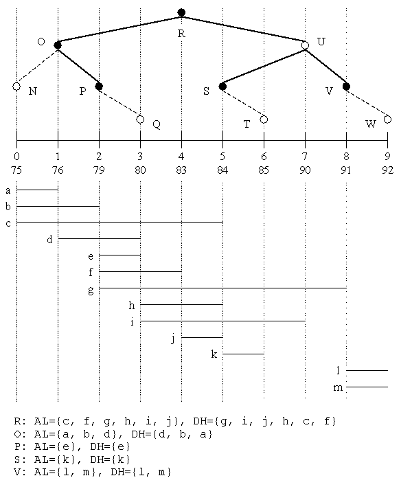

# Interval Trees

**Yogi Dandass**

*Yogi Dandass is a researcher at Mississippi State University’s High Performance Computing Laboratory and is also working towards a Ph.D. degree in Computer Science. He designs software libraries in C++ for numerical computing, artificial intelligence, and real-time communication middleware. He can be reached at yogi@erc.msstate.edu.*

---

We know that a tree is often a good way to represent an ordered set of values. It can also be a good way to order a set of ranges as well.

## Introduction

Programmers frequently need to store and retrieve values that describe a limited numerical range. A range is specified by a value pair, `l` and `h` such that `l <= h`, representing an interval `[l, h]`. The interval endpoints typically lie on the real number line, but in applications they are represented as values of floating-point, integer, character, or some other ordered type (such as date or time). To iterate over those entities with intervals containing a particular value, you can use a simple array-like container. But if you need more efficient access, you need a more sophisticated data structure.

For example, consider a large meteorological database consisting of the daily temperature ranges at various observation stations around the world.

```cpp
#include <time.h>

class observation {
public:
   typedef float range_type;

   observation(range_type rHigh, range_type rLow, short sID, time_t DateTime)
      : m_rHigh(rHigh), m_rLow(rLow), m_sID(sID),
        m_tmDate(DateTime) {}
   float low() const { return m_rLow; }
   float high() const { return m_rHigh; }
   short id() const { return m_sID; }
   time_t date() const { return m_tmDate; }

private:
   range_type  m_rHigh, m_rLow;
   short       m_sID;
   time_t      m_tmDate;
};
```

Figure 1 shows a possible implementation of the observation class that represents a record in the database. The member functions `low` and `high` return the temperature values representing the daily low and high temperatures, respectively. The `id` and `date` member functions return the station identifier and date of observation respectively. From the thousands of observations, you need to extract those that contain a given temperature value, `t` (i.e., `low() <= t <= high()`).

An array-based storage scheme (possibly implemented using an STL `vector` container) and a brute-force search through the entire database is acceptable only if a single extraction is to be performed or if the number of elements is small. For example, if you know all the temperature values of interest in advance, you need to make only one pass through the array. However, if you can interactively specify different temperature values at different times, the brute-force search technique becomes impractical because every element in the array must be examined during each extraction operation. If you sort the array in ascending order of the low-temperature values, you can terminate the sequential search when you reach the object whose low value is greater than `t`. Unfortunately, this technique becomes increasingly ineffective as `t` increases, because fewer observations are eliminated.

In this article, I present an STL-like container class based on the interval-tree data structure for storing interval objects, and STL-like iterator classes that efficiently access just those elements whose intervals contain a given query value. Furthermore, I leverage existing STL classes and algorithms to minimize the amount of new code I needed to write for this implementation.

## Interval Tree Data Structure



Figure 2</a> illustrates the interval tree built from the following list of labeled intervals:
```
a=[75, 76], b=[75, 79], c=[75, 84],
d=[76, 80], e=[79, 80], f=[79, 83],
g=[79, 91], h=[80, 84], i=[80, 90],
j=[83, 84], k=[84, 85], l=[91, 92],
m=[91, 92]
```

Conceptually, the interval tree is based on the binary tree constructed from the sorted set `X` of unique end-point values of all the intervals:
```
X = {75, 76, 79, 80, 83, 84, 85, 90, 91, 92}
```

Each node in the tree consists of a discriminant value and two lists, ascending low (AL) and descending high (DH), that contain those intervals encompassing the discriminant value. Both AL and DH of a node contain the same intervals; however, AL is sorted in ascending order of the lower endpoints of its constituent intervals and DH is sorted in descending order of the upper endpoints.

To construct the root of the interval tree, you select the median member of `X`. This forms the root’s discriminant value. In Figure 2, the discriminant for the root is `83` at offset 4. Next, you select the intervals that contain the discriminant value and insert them into the root’s AL and DH lists. Here:
```
AL = {c, f, g, h, i, j}
DH = {g, i, j, h, c, f}
```

The left subtree from the root is constructed recursively in a similar manner by considering the members `X` to the left of (less than) `83` and the remaining unassigned intervals. The right subtree is also recursively constructed by considering the members of `X` to the right of (greater than) `83` and the intervals that remain unassigned after the construction of the root and left subtree. It is important to note that an interval is assigned only once to any node. However, there is no restriction on the number of identical intervals that can be stored in the tree (e.g., intervals `l` and `m` in Figure 2).

A subtree is considered to be empty if all of its nodes have empty AL (and consequently DH) lists. Since an empty subtree provides no additional information, you may eliminate it from the interval tree in order to conserve memory. Figure 2, nodes with empty AL and DH lists (`N`, `Q`, `T`, `U`, and `W`) are shown as hollow circles. Any empty node that can be eliminated is connected to its parent using a dashed line (e.g. `N`, `Q`, `T`, and `W`). It is possible for nodes with empty AL and DH lists to still be a part of the tree (such as `U`) because it has non-empty child nodes.

Given a query value, `q`, you report all intervals that contain this value by first examining the discriminant at the root node. If `q` is equal to the discriminant, then you simply report all the intervals in the node’s AL list and end the traversal process. If `q` is less than the discriminant, you report the intervals in the node’s AL list in sequence, starting at the beginning of the list, until you reach an interval whose lower endpoint is greater than `q`. You then recursively apply this procedure to the left subtree. If `q` is greater than the discriminant, you report all the intervals in the node’s DH list in sequence, starting at the beginning of the list, until you reach an interval whose higher endpoint is less than `q`. You then recursively apply this procedure to the right subtree.

## Implementation

Since the tree construction process is time consuming and complex, I avoid dynamically maintaining the interval tree when intervals are being added, modified, and/or deleted. Instead, the interval tree operates in two distinct modes. During the initialization mode, you can use the tree container like the standard `vector` container. Once you have inserted the intervals, you call the container’s `construct` method. This puts the container in the query mode. If you modify any of the low/high values when the container is in this mode, you may destroy the integrity of the interval tree. Therefore, you should call the container’s `destruct` method to revert back to the initialization mode before making any changes to the intervals stored in the container.

Figure 1 shows the key implementation features of an interval class. The interval class must define a type `range_type` that represents the data type of the endpoints of the range. This data type must have the following operators defined over it:
* `operator=` is used to assign values to the discriminant (which is also of type `range_type`.
* `operator==`, `operator<=`, and `operator>=` are used to compare the endpoints to the discriminant.
* `operator<` and `operator>` are used to sort the AL and DH lists.

Furthermore, the interval class must also define member functions `low` and `high` which return the low and high endpoints, respectively, of the interval. The return type of these functions must also be `range_type`. The built-in scalar and floating-point data types in C++ meet all the requirements of the `range_type` type.

[Figure 3](Itree.h) shows the implementation of the interval tree template class, `itree`. This class is based on, and takes the same template parameters as, `std::vector`. Template parameter `t` represents the interval class whose instances will be stored in the container. I redefine `t` and `T::range_type` as `invl_type` and `range_type`, respectively, to enhance code clarity. Since, the container will look and behave like an STL `vector` during the initialization mode, I define `invl_vec` as `std::vector<invl_type>` and the private data member `invals` of type `invl_vec`.

Vector `invals` provides the underlying `vector` container functionality for the interval tree container. The `al` and `dh` data members are vectors containing pointers to intervals. I used these vectors to maintain the AL and DH lists for the interval tree’s nodes. Each node needs only an index indicating where its lists begin and the number of items in the lists (see Figure 3). Since the number of items in the AL and DH lists is the same in a node, the node needs only one `start` and one `size` member.

To force the interval tree class to behave like a standard vector of intervals, I duplicate the `vector` container’s public type definitions and member functions within the interval tree container class. The duplicated member functions call the corresponding functions in vector `ivals`. The reason for this extra level of forwarding is to force the non-const `vector` functions to fail if the interval tree is in query mode, preventing the accidental modification of the tree structure. Since I use the `assert` macro to perform the run-time check, and the functions are inlined, the overhead of the extra function call will be optimized away by the compiler for production-level code. Of course this technique for avoiding inadvertent modification of the intervals is not foolproof and only works during the application’s development phase.

[Figure 4](Itsample.cpp) illustrates how an application uses the interval tree container class. Any of the container’s const or non-const accessor functions can be called when it is in the initialization mode. However, once you have constructed the interval tree, only the const member functions may be called via a const reference to the interval tree container.

The interval tree construction is performed by the `construct` method. In this function, I first call `extract_values` to build a sorted vector of unique interval end-point values. Next, I call the recursive function `construct_tree` to build the interval tree, starting at the root. The flags parameter to `construct_tree` tracks the intervals that have been assigned to a node and should not be considered further.

The `num_al_dh` parameter maintains a running count of the number of entries in the `al` and `dh` vector pair that have been occupied so far. It is used to populate the `start` member of the current node. The `start` and `end` parameters are the starting and ending (inclusive) indices of the endpoint values that should be considered when determining the discriminant for the current node.

The `construct_tree` function is a direct implementation of the recursive interval tree construction process described above. I skip over any interval that has already been assigned to a node, locate the discriminant value from the values parameter, and add the pointers to the intervals that contain the discriminant of the node’s AL and DH lists. An interval whose high endpoint is less than or greater than the node’s discriminant will be in the left or right subtree of the node, respectively. I maintain indicators for whether such intervals exist using the `continue_left` and `continue_right` flags. If the existence of any intervals in the right and/or left subtrees is not indicated, I prune the tree by assigning a null pointer to the corresponding subtree’s pointer.

The member function `deconstruct` calls the recursive function `delete_node` to delete the nodes of the interval tree. However, the vector containing the intervals is not disturbed.

## Query Iterator

The query iterator class `query_iterator`, derived from the standard forward iterator, is shown in [Figure 5](Itree.h). Since it is a forward iterator, reverse and random iteration is disallowed. I maintain the current state of the retrieval process (defined by the current node, query value, and the position of the iterator in the node’s AL and DH lists) in the private data members of `query_iterator`.

I provide a public default constructor for `query_iterator` that creates an uninitialized iterator. In order to create an initialized iterator, you must call the `itree`’s `qbegin` method, and provide a query value. In the `qbegin` function, I use the iterator class’s private constructor (the `itree` class is as a friend of `query_iterator`) to create a partially initialized iterator. I complete the initialization of the iterator by calling its `init_node` member function. The `init_node` function locates the node closest to the root that contains intervals that contain the query value, and sets the position of the iterator to the beginning of the node’s AL and DH lists.

In the iterator’s `increment` method, I update the iterator’s position in the AL and DH lists so that the dereferencing operators report the next valid interval. If the next valid interval is the interval pointed to by the subsequent entry in the node’s AL or DH list, I simply increment the iterator’s index member. However, if the interval is in a subtree, I set the interval’s `cur_node` member to the appropriate child node, and call the iterator’s `init_node` method. If there are no more intervals containing the query value, I assign a null pointer to the `cur_node` member and zero to the index member.

In the functions for the iterator comparison operators (`operator==` and `operator!=`), I compare the `value`, `cur_node`, and `index` members of the two iterators. Therefore, in `qend`, I return an iterator with the `cur_node` member set to a null pointer and the `index` member set to zero in order to make it easy to test for the end of a query iteration process.

## Enhancements

I have made several compromises in order to keep this implementation simple and small. The most significant is not updating the interval tree dynamically. However, the mode-based implementation has not been an inconvenience because most of my programs perform insertions and queries in bursts. If your applications call for interleaved update and query operations, this implementation may not have satisfactory performance. If your application utilizes a stable set of intervals, you may need to execute the time-consuming tree construction code only once, by implementing code that streams the constructed interval tree to a file. Finally, I have used the `assert` macro extensively to prevent the inadvertent modification of intervals when the container was in query mode. You may prefer to implement a more robust error-handling scheme by throwing exceptions at the appropriate places in the code.

For further information regarding interval trees and an application, please see the paper “[Speeding Up Isosurface Extraction Using Interval Trees](https://doi.org/10.1109/2945.597798)”, by Paolo Cignoni et al., *IEEE Transactions on Visualization and Computer Graphics*, Volume 3(2), April-June 1997.
