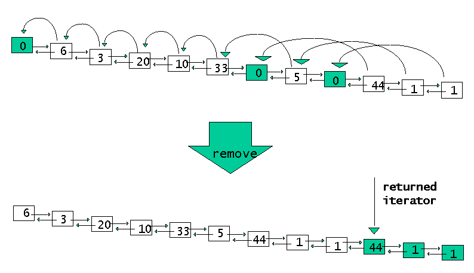

# Effective Standard C++ Library: Are Set Iterators Mutable or Immutable?

**Klaus Kreft and Angelika Langer**

*Klaus Kreft is Senior Consultant at Siemens Business Services in Germany. He can be reached at klaus.kreft@mch20.sbs.de. Angelika Langer works as an independent instructor and mentor. She can be reached at langer@camelot.de. They are authors of the book **Standard C++ IOStreams and Locales**.*

---

In this column, we look into implementations of the Standard library container `set`, how these implementations vary, and how the differences affect the portability of our applications. In brief:
* The `set` container in the Standard C++ library is implemented as a binary tree, which means that the value of an element contained in a set determines its position in the internal tree structure. Like all containers in the Standard library, the `set` container gives access to its contained elements via iterators. Iterators are designed to give read and write access to the element they refer to by means of the dereference operator. In other words, we can modify elements in a container via the container iterators.
* In a `set` container, the modification of a contained element can result in corruption of the underlying tree structure [1]. Consequently, `set` iterators that give write access (so-called *mutable* iterators) are considered dangerous. Even more so since iterators are passed to algorithms and for certain algorithms (including the remove algorithms), it is not at all obvious that they corrupt a `set` container.
* Some library implementers try to address the problem by not providing mutable `set` iterators in the first place. This is safe, but comes at the cost of major restrictions on the usability of the set container. For this reason, other implementers decide to trust the user, and they provide mutable `set` iterators. The net effect is that there are different implementations of the `set` container and its iterators available, so we must keep an eye on portability issues.

In this column, we look into the different `set` implementations, take a look at pitfalls and restrictions they introduce, and explore what the portability issues are and how they can be addressed.

## The Underlying Tree Structure

The `set` container provided by the C++ Standard library is internally organized as a binary tree structure because the Standard defines certain complexity guarantees for all algorithms and container operations. For the `set` container, it requires that access to an element contained in a set must be performed in logarithmic time. In order to meet this requirement, the implementation of the `set` container must be based on a binary tree structure. (Details on binary tree structures can be found in every computer science book on data structures and algorithms [2].)

Elements in a binary tree are arranged in a way that their position in the tree is determined by a sorting order. This is visible in the `set` container: it needs a comparator that represents an ordering on the element type. Let us consider an example. Assume we have a bank account class. It has an account number and a balance. In our application, we maintain all the bank accounts in a `set` container. The sorting criteria is the account number. The `set` uses the less-than operator defined for the element type account as a comparator, and there is an corresponding version of `operator<` defined that compares account objects by comparing their account numbers.

```cpp
class account {
 ...
 size_t _number;  // determines ordering
 double _balance; // irrelevant for ordering
};

bool operator<(const account& lhs,
               const account& rhs)
{ return lhs._number < rhs._number; }

set<account> allAccounts;
```

The `set` uses the ordering to determine an element's position in the underlying binary tree. Whenever an element is inserted to the `set`, it is automatically placed into the right location in the tree structure so that the `set` elements are always maintained in sorted order. When an element must be found, the respective search also uses the ordering for efficient navigation through the tree structure. Since all operations performed on the `set` rely on the properly arranged binary tree, it is essential that the tree is kept intact at all times.

Naturally, the binary tree is hidden behind the interface of the `set` container class, and as long as we perform modifications on a `set` container via member functions of the `set` class, we will never corrupt the underlying tree structure. However, container classes in the standard library have iterators.

## The Set Iterators

Like all containers in the Standard library, the `set` container gives access to its contained elements by means of iterators. Iterators are pointer-like objects that can be dereferenced (via the dereference `operator*`) in order to access the element they point to. There are two types of iterators: those that give read and write access (let's call them *mutable* iterators) and those that give only read access (the *immutable* iterators). In the Standard library, the mutable iterators are of type `container::iterator`; the immutable iterators are of type `container::const_iterator`. All container classes, including the `set` container, must defines these two iterator types.

If we have a mutable `set` iterator and dereference it, we will get write access to an element contained in a `set` container and can modify its content. Such a modification can be quite disastrous. Think of what we are doing here: the iterator points to a node in the binary tree. The position of the element in the tree is currently correct and reflects the element's position in the sorted sequence of contained elements. When we change the element in a way that affects the sorting order (e.g. by modifying data members that are relevant to the comparator), then the element would have to appear in a different position regarding the sorting order. The tree structure would have to be reorganized in order to reflect the new sorting order. But that's not what will happen. We silently modify the element without changing its position in the binary tree. The result is a corrupted tree, and the behavior of operations on a corrupted tree is entirely unpredictable.

Obviously, it is not sensible to modify `set` elements through mutable `set` iterators. Hence the unwritten rule is:
> Rule 1: Never modify elements contained in a set container in a way that breaks the sorting order.

This rules applies to all modifications through iterators, pointers, and references to elements contained in the `set`. While this rule is plausible, it turns out that it is much harder to follow than one might think.

## Replacing Set Elements

Let us revisit the example to see how easy or difficult it is to follow the rule. We maintain a set of bank accounts that is sorted by account numbers. One of the clients wants to switch to another type of account and asks for his old account to be replaced by a new one. If we have an iterator pointing to the old account object, we can implement the replacement as follows:

```cpp
set<account> s;
...
set<account>::iterator iter;
...
*iter = *new account;  // direct modification of element
```

This clearly violates Rule 1. While the new account will have the same data as the old one (such as name, balance, etc.), it will most likely have a different account number. Overwriting the existing position in the tree with new content will therefore include overwriting the sorting criteria and corrupt the tree structure. In order to replace an existing element in a `set` with a new element, we should use the member functions `insert` and `erase` rather than performing the replacement through a `set` iterator. The correct approach would be:

```cpp
set<account> s;
...
set<account>::iterator iter;
...
s.insert(iter, *new account);
s.erase (iter);
```

The `insert` member function places the new element at the right position in the tree structure, thus keeping the tree intact. It follows another rule:
> Rule 2: Do not perform replacement of an element in a `set` through an iterator, pointer, or reference. Use the `set` operations `insert` and `erase` instead.

## Set Containers and Generic Algorithms

This is a relatively obvious violation of Rule 1. But often the violations are less obvious. How about the following program? In our bank application, cancelled bank accounts are not immediately eliminated for the set of all bank accounts, but stay there for a while until a garbage collector removes them. Obsolete bank accounts can be recognized by their zero balance. They can be removed all at once using the `remove_if` algorithm. All we need is a predicate function that determines whether the balance is zero:

```cpp
bool obsolete(const account& acc)
{ return acc.balance() == 0; }
```

Then we apply the `remove_if` algorithm and get the job done real quick:

```cpp
set<account> s;
...
// remove element if balance is less than 0
s.erase(remove_if(s.begin(), s.end(), obsolete),
        s.end());
```

Looks good at first sight, but it turns out that we corrupt the `set` container with this approach.

## Misnomers: `remove` Does Not Remove

In this case, it is not so obvious why we violated Rule 1. Did we affect the sorting order in any way? From the specification of the `remove_if` algorithm, one might conclude that we just removed certain elements from the sorted sequence, which yields another sorted sequence. In fact, the Standard specifies the `remove_if` algorithm as:

```cpp
template<class ForwardIterator, class Predicate>
       ForwardIterator remove_if(ForwardIterator first,
                                 ForwardIterator last,
                                 Predicate pred);
```

* Requires: Type `T` is `EqualityComparable`.
* Effects: Eliminates all the elements referred to by iterator `i` in the range `[first, last)` for which the following corresponding conditions hold: `pred(*i) != false`.
* Returns: The end of the resulting range.
* Notes: Stable; the relative order of the elements that are not removed is the same as their relative order in the original range.
* Complexity: Exactly `last - first` applications of the corresponding predicate.

Why then does the removal break the tree structure?

The answer is that all mutating algorithms potentially break the tree structure of a `set` container. This is because the generic algorithms in the Standard library access container elements via iterators, and if they are mutating algorithms, they perform the modification through container iterators. The `remove_if` algorithm is a mutating algorithm in this sense.

The crux it that the remove algorithms (this includes `remove`, `remove_if`, and consorts) are frequently misunderstood. Their names are misnomers: a remove algorithm does not remove anything. In fact, not a single element is erased from the sequence [3]. Instead, all the valid elements (those accounts that are not obsolete in our example) are copied to the beginning of the sequence, leaving a piece of garbage at the end. The `remove_if` algorithm returns an iterator pointing to the garbage at the end of the sequence and we must manually remove the invalid elements by invoking the `erase` member function of the `set` container class. Figure 1 illustrates the functionality of the `remove_if` algorithm.



Inside the `remove_if` algorithm, the copying of valid elements to the beginning of the sequence is performed through iterators pointing to elements in the sequence. The algorithm does exactly what we identified as a problem under Rule 2: it assigns one element to another element through dereferenced iterators. Inside the implementation of any remove algorithm, we will find a statement such as:
```cpp
*iter1 = *iter2;
```
where `iter1` and `iter2` are `set` iterators in our case. This assignment breaks the sorting order.

Hence, it follows yet another rule for `set` containers:
> Rule 3: Never apply a mutating algorithm to a `set` container.

In this context, "mutating algorithms" are algorithms that modify container elements through container iterators (or references or pointers to container elements) rather than performing modification through container operations (the member function of a container). All generic algorithms in the Standard library that are mutating algorithms (such as `copy`, `swap`, `replace`, `remove`, `reverse`) fall into this category.

## The Dilemma

It should be clear by now that mutable `set` iterators are a true pitfall, because they make it easy to (inadvertently) corrupt a `set` container. Why then would we want to have them at all? As we will see later, it makes perfect sense that containers have mutable iterators, since we not only want to inspect elements stored in a container, but occasionally we would also want to modify those elements. Furthermore, the Standard mandates that all containers must have a mutable and an immutable iterator type. This is intrinsic to the concept of a container. Dropping the mutable iterator type for the `set` container would defy the idea of genericity that is central to the design of the containers and algorithms in the Standard library. As a result, library implementers are in a bind, and the Standard does not say how to escape the dilemma.

Some library implementers decide to trust their users, and with those implementations (let's call them the *relaxed* implementations), it is our responsibility to make sure that we do not damage the tree structure. This, however, is often more difficult than one might think, as demonstrated above.

Other implementations aim to reduce the inherent danger and decide not to provide a mutable `set` iterator at all. In those implementations (let's call them the *safe* implementations), the type `set::iterator` is a `typedef` for `set::const_iterator`. The effect is that an element stored in a `set` container cannot be modified through an iterator. This is obviously safer, since it at least removes the potential to corrupt the tree structure through iterators. We can still damage the `set` container via pointers and references to contained elements, but not providing a mutable `set` iterator is certainly an improvement. However, it has its price; it is kind of restrictive.

Modifying an element does not necessarily affect the sorting order. What if we just change a part of the element that is not relevant to the ordering? That would be a harmless modification. Sadly, if the `set` does not have a mutable `set` iterator, then we cannot even perform harmless modifications through an iterator, although it would be safe to do so.

## Harmless Modification of Set Elements

Recall the example. We use a set of bank accounts and the sorting criteria is the account number.

```cpp
class account {
 ...
 size_t _number;  // determines ordering
 double _balance; // irrelevant for ordering
};

bool operator<(const account& lhs,
               const account& rhs)
{ return lhs._number < rhs._number; }

set<account> allAccounts;
```

In this case, the balance is irrelevant for the sorting order, and it would be safe to modify the balance data member of an account object stored in the `set` container.

```cpp
set<account>::iterator iter;
...
// direct modification of part of the element
iter->balance = 1000000;
```

In a *relaxed* `set` implementation, this will work; when using a *safe* `set` implementation, the compiler will complain about a `const`ness problem. No doubt, the program makes sense, but it is built on the assumption that the `set` iterator is mutable, which in practice is unnecessary. Hence we have a problem. The problem is mainly a portability issue [4]. What works under one implementation of the Standard library does not work under another.

How can we solve the problem?

## The Brute Force Approach

Constness problems can be solved by casting away constness, right? Instead of saying

```cpp
iter->balance = 1000000;
```

we would say

```cpp
*(const_cast<double*>(&(iter->_balance))) = 1000000;
```

Note that you cannot perform a `const_cast` on an object, but only on pointers and references. Alternatively we could define a `const` member function in the `account` class that lets us modify the balance, but I hope we agree that casts and faked `const` member functions are bad programming style and should be avoided if possible. Let's try to do better.

## An Iterator Adapter

While we cannot eliminate the `const_cast`, we could still try to get to the core of the problem and solve it exactly where it pops up. It's the `set` iterator that gets us into trouble. Why don't we define a new iterator type that gives us access to the balance part of an account, but does not expose the account number? The idea is to adapt the `set` iterator so that the adapted iterator allows harmless modifications, but prohibits modification of the parts that are relevant for the sorting order.

Instead of accessing the element through a `set` iterator
```cpp
set<account>::iterator iter;
...
iter->balance = 1000000;
```

we would access it through an adapted iterator, called `balanceIter`:
```cpp
set<account>::iterator iter;
...
*balanceIter(iter) = 1000000;
```

In practice, C++ programmers are reluctant to implement their own user-defined iterator types because they think it is too complicated, but it is actually quite easy and very helpful. Below is the sketch of an implementation:
```cpp
class balanceIter {
private:
 set<account>::iterator _i;

public:
 explicit balanceIter(set<account>::iterator i)
 : _i(i) {}

 balanceIter& operator++() { ++_i; return *this; }
 // ... postfix ++, pre- and postfix -- ...

double& operator*() const
 { return *const_cast<double*>(&_i->_balance); }
};
```

The key points are:
* The iterator adapter stores the original iterator (the *adaptee*) as a data member.
* The adaptee is provided at construction time; that is, the constructor takes the original iterator as a constructor argument.
* All typical iterator operations must be provided, such as `operator++`, `operator--`, `operator==`, and so on and so forth. They are implemented by delegation to the adaptee.
* The only interesting operation is the dereference operator. It must give write access to the balance part of the account object. Its signature differs from the signature of the adaptee's dereference operator, because it returns a non-`const` reference to the balance part instead of a `const` reference to the entire account object.

There are a couple of further details to keep in mind when implementing iterator types, such as providing a base member function that gives access to the adaptee and providing certain types that are required of iterator types. (See [Listing 1](list1.cpp) or [5] for further reading, or consult your favorite Standard library book for a recipe on implementation of iterator adapters).

## Evaluation

We still have to do the ugly `const_cast` in some places, but it is now hidden in the dereference operator of the iterator adapter. There was no modification of the `account` class necessary and no blatant violation of const-correctness rules. And we solved exactly the problem we had encountered without opening additional safety holes. There still is an the existing safety hole; we can apply mutating algorithms to the `set` via the adapted iterator, but this risk is already covered by Rule 3: never apply a mutating algorithm to a `set` container. In addition, this solution is portable. Even when we use a *relaxed* `set` implementation, the iterator adapter would not hurt. Since all its operations are inline functions, it would not add any overhead.

In order to avoid portability problems, here is another recommendation:
> Rule 4: Never modify an element contained in a `set` through a `set` iterator (of type `set<T>::iterator`). Use an iterator adapter for modification of `set` elements that do not break the sorting order.

Modifications that do not break the sorting order are changes in those parts of the contained elements that do not contribute to the sorting order.

## Summary

The C++ Standard does not specify whether the iterator of a `set` container (type `set<T>::iterator`) is a mutable or immutable iterator. As a result, popular compilers and their Standard libraries provide different implementations of the `set` iterator. Programs that work under one implementation might not work under another. In order to avoid portability problems, never make any assumptions regarding the (im)mutability of the `set` iterator.

We identified four rules that are relevant for using `set` containers:
> Rule 1:  Never modify elements contained in a `set` container in a way that breaks the sorting order.

> Rule 2:  Do not perform replacement of an element in a `set` through an iterator, pointer, or reference. Use the `set` operations `insert` and `erase` instead.

> Rule 3: Never apply to a `set` container an algorithm that modifies container elements through iterators, references, or pointers to container elements. This includes all mutating generic algorithms in the Standard library.

> Rule 4: Never modify an element contained in a `set` through a `set` iterator (of type `set<T>::iterator`). Use an iterator adapter for modification of `set` elements that do not break the sorting order.

Rules 1 through 3 are always true independently of any particular implementation of the Standard library. Rule 4 addresses the portability issues that arise in practice due to different implementations of the `set` container and its iterator type.

## Notes and References

1. Herb Sutter. "Standard Library News, Part2, Sets and Maps", *C++ Report* (October 1999). This article gives background information on sets and maps; Sutter explains why keys in associative arrays like `set` must not be modified.
2. Cormen, Leiserson, and Rivest. "Introduction to Algorithms" (MIT Press, 1990).
3. Matt Austern. "Algorithms and Containers", *C++ Report* (July/August 2000). This article also points out the problem of applying the remove algorithms to associative containers and suggests a solution using container-based generic algorithms and container traits, which are not part of the Standard.
4. How can one have a portability problem with the Standard library? After all, the purpose of a standard is that it defines a portability platform. True, it's just that in this case we are talking about an open issue in the C++ Standard: the implementation of the `set` iterators is still an open issue (#103) on the Standards Committee issue list. The problem is identified and a clarification will be added to the Standard.
5. Klaus Kreft and Angelika Langer. "Iterators in the Standard C++ Library", *C++ Report* (November/December 1996). The article is also available at [http://www.langer.camelot.de/Articles/IteratorsInStdlib/cppr9612_kreft.html](https://web.archive.org/web/20050308162147/http://www.langer.camelot.de/Articles/C++Report/IteratorsInStdlib/IteratorsInStdlib.html).
